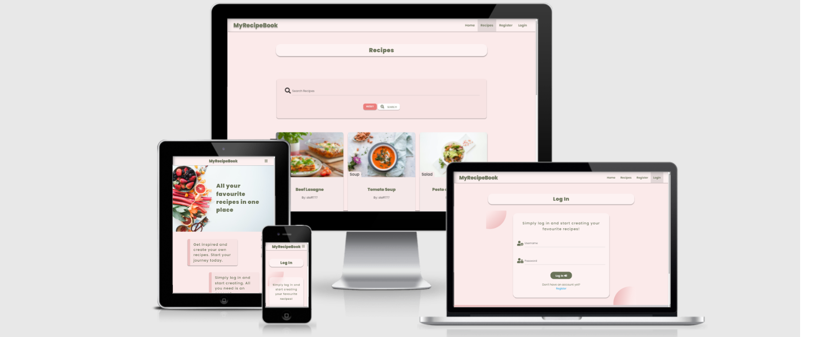
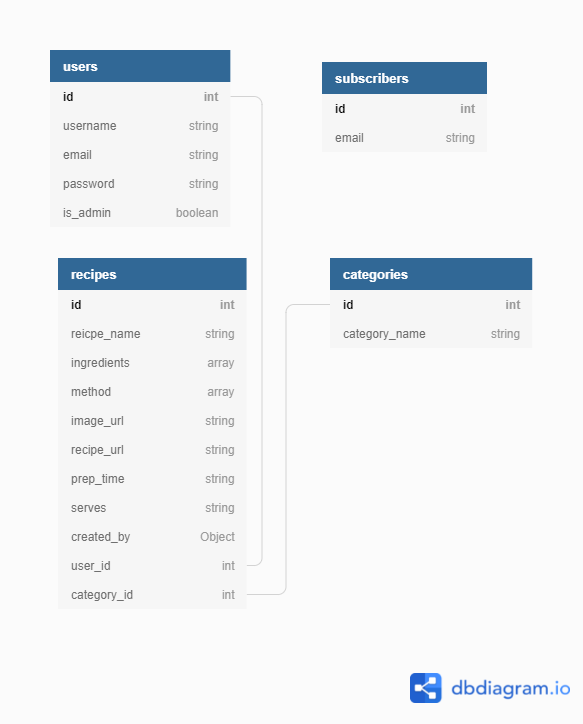

## UX 
### Project Goals
The primary goal of **MyRecipeBook**, is to allow the users to _create_, _save_, _search_ and _view_ their favourite recipes in one place.

Use _HTML5_, _CSS3_, _JavaScript_, _Python_, _Flask_, and _MongoDB_
#### User Goals
The user is looking for web-based app where they can:
- Use CRUD convensions to:
    - Create a recipe
    - Read(View) recipe
    - Update(Edit) recipe
    - Delete recipe they created
- Be able to search the database for recipes
### User Stories
**_As a first time visitor, I want to be:_**
- Able to easily find recipes stored in the database.
- Able to view full recipe and get valuable information.
- Able to Create and Account.

**_As a returning visitor, I want to be:_**
- Able to log into my account and have access to all features of the site.
- Able to Add(Create) recipes and store them in the database.
- Able to View my own recipes
- Able to Edit recipe
- Able to Delete a recipe(s) I have created.
### Design
- #### Typography
    - The primary font used is **Poppins**, and **Sans Serif** is used as a fallback font.
-   #### Images
## Data Schema
[MongoDB](https://www.mongodb.com/) was used for this project and schema design was created. See below:

### Users Collection
- Upon regisering, the user will provide:
    - Username
    - Email Address
    - Password
    - is_admin is given a default value of False.

### Recipes Collection
- When creating a new recipe the user will provide the following:
    - Recipe Name
    - Recipe Image URL
    - Original Recipe URL(not required but needed to avoid copyright issues)
    - Category
    - Ingredients
    - Method
    - Prep Time (Total time needed to prepare the recipe)
    - Number of Serves
    - Created By (it will get a value of the current user in session)

### Categories Collection
- Currently there are four categories the user can choose from:
    - Main
    - Starter
    - Salad
    - Soup

### Subscribers Collection
- If the user decides to subscribe for the newsletter he/she will have to provide:
    - Email Addres (which is stored in the collection)
### Wireframes
[Wireframes part 1](https://github.com/steff880/MS3-MyRecipeBook/blob/main/assets/wireframes/wireframes-part1.png)

[Wireframes part 2](https://github.com/steff880/MS3-MyRecipeBook/blob/main/assets/wireframes/wireframes-part2.png)
## Features
## Technologies Used
### Languages
- [HTML5](https://en.wikipedia.org/wiki/HTML5)
- [CSS3](https://en.wikipedia.org/wiki/CSS)
- [JavaScript](https://en.wikipedia.org/wiki/JavaScript)
- [Python](https://en.wikipedia.org/wiki/Python_(programming_language))
### Frameworks, Libraries & Programs Used
- [Materialize](https://materializecss.com/)
    - Materialize was used to help with the responsiveness and styling of the website. 
- [Balsamiq](https://balsamiq.com/)
    - Balsamiq was used for creating the wireframes for this project.
- [jQuery](https://jquery.com/)
    - jQuery was mainly used to initialize some Materialize components.
- [Google Fonts](https://fonts.google.com/)
    - Google Fonts was used to import the **Poppins** font, which was used throughout the project.
- [Font Awesome](https://fontawesome.com/)
    - Font Awesome was used for all icons used in this project.
- [GitHub](https://github.com/)
    - GitHub is used to store the project's code after being pushed from Git.
- [Git](https://git-scm.com/)
    - Git was used for version control by utilizing the Gitpod terminal to commit to Git and Push to GitHub.
## Resources
## Testing
## Deployment
## Credits
### Code
### Images
### Acknowledgements