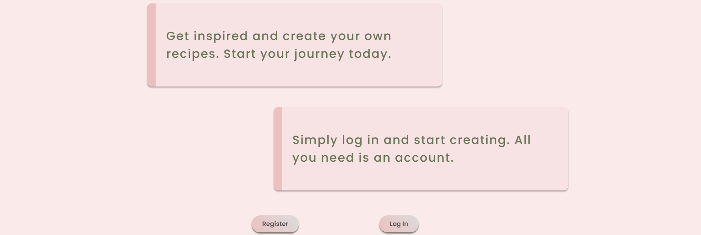

<h1 align="center">MyRecipeBook</h1>

## UX 
### Project Goals
The primary goal of **MyRecipeBook**, is to allow the users to _create_, _save_, _search_ and _view_ their favourite recipes in one place.

Use _HTML5_, _CSS3_, _JavaScript_, _Python_, _Flask_, and _MongoDB_
#### User Goals
The user is looking for web-based app where they can:
- Use CRUD convensions to:
    - Create a recipe
    - Read recipe
    - Update(Edit) recipe
    - Delete recipe they created
- Be able to search the database for recipes
### User Stories
**_As a first time visitor, I want to be:_**
- Able to easily find recipes stored in the database.
- Able to view full recipe and get valuable information.
- Able to Create and Account.

**_As a returning visitor, I want to be:_**
- Able to log into my account and have access to all features of the site.
- Able to Add(Create) recipes and store them in the database.
- Able to View my own recipes
- Able to Edit recipe
- Able to Delete a recipe(s) I have created.

**_As an Admin user of the site, I want to:_**
- Be able to add new categories

_Please note that currently Admin user can only add **categories**_

### Strategy

- For this project, the targeted audiences are:
    - Food Lovers
    - People, who are passionate about cooking
    - People of all ages
    
- The website enables the user to:
    - Register or Log in to account
    - View Recipes
    - Search Recipes, by category or name, even by ingredients
    - Create their own recipes and upload them to the database
    - View the full recipe they have created, or someone elses
    - Edit recipes they  have created
    - Delete a recipe created by them

### Scope

- What the user will look for:
    - Easy navigation
    - Welcoming Design
    - Search the database for recipes
    - Add their own recipe
    - Manage recipes (Edit, Delete)
    - Save and View full recipe
    - Be able to Register and Login

### Design

#### Colors

- Colors used for text:
    - #515251
    - #6A7359
    - #fff
- Background colors:
    - rgba(241, 183, 183, 0.29)
    - rgba(255, 255, 255, 0.28);
    - rgba(255, 255, 255, 0.8)
    - rgba(243, 222, 222, 0.3)
    - rgba(255, 255, 255, 0.4)
    - #f7e3e3
    - #f48b89
    - #6A7359
    - #515251
    - #eab0b1
    - #f5e9e9
    - #e06666
    - #ec7f7d

#### Typography

- The primary font used is **Poppins**, and **Sans Serif** is used as a fallback font.

## Data Schema
[MongoDB](https://www.mongodb.com/) was used for this project and schema design was created. See below:

### Users Collection
- Upon regisering, the user will provide:
    - Username
    - Email Address
    - Password
    - is_admin is given a default value of False.

### Recipes Collection
- When creating a new recipe the user will provide the following:
    - Recipe Name
    - Recipe Image URL
    - Original Recipe URL(not required but needed to avoid copyright issues)
    - Category
    - Ingredients
    - Method
    - Prep Time (Total time needed to prepare the recipe)
    - Number of Serves
    - Created By (it will get a value of the current user in session)

### Categories Collection
- Currently there are four categories the user can choose from:
    - Main
    - Starter
    - Salad
    - Soup

### Subscribers Collection
- If the user decides to subscribe for the newsletter he/she will have to provide:
    - Email Addres (which is stored in the collection)
### Wireframes
[Wireframes part 1](https://github.com/steff880/MS3-MyRecipeBook/blob/main/assets/wireframes/wireframes-part1.png)

[Wireframes part 2](https://github.com/steff880/MS3-MyRecipeBook/blob/main/assets/wireframes/wireframes-part2.png)
## Features

- Each page has a responsive and fixed to the top navigation, in order for the user to be able at any moment to navigate to a different page.
- A class *active* is given to the current page link in the navigation, highlighting it for the user.

- The **_Footer_** of the site contains social media links and and Newsletter subscription

- If the user is logged in their account, will have access to:
    - Profile page
    - Add Recipe page
    - Update Recipe
    - Delete Recipe
    - View Full Recipe
    - If the user is _admin_, then will have access to Manage Categories, where new categories can be added.
- The website uses _cards_ to display recipes, giving short info for the user:
    - Recipe image
    - Recipe Category
    - Recipe Name
    - Created by
    - A button to view full recipe

### Existing Features

- Home Page

    - Hero Image with a welcome text

    

    - Short text prompting user to create an account and start adding recipes and **cta** buttons

    

- Rcipes

    - A search bar where the user can search for recipes

    

    - Recipe cards

    

- Rgister

    - Registration Form allows the user to:
        
        - Enter their desired username

        - The password field uses [Werkzeug](https://werkzeug.palletsprojects.com/en/2.0.x/) to hash the password on entry and confirm password is validated using Javascript. If the passwords do not match, a disabled class is added to the Register button, preventing the user from submitting the form with incorrect password.

        - Email Address field where the user has to enter their **email**

        - Register button, to submit the form when all fields are filled correctly.

    

- Login 

    - Login page allows the user to:

        - Enter the username used when registered.

        - Use the password created when registered and [Werkzeug](https://werkzeug.palletsprojects.com/en/2.0.x/) will un-hash the password for user authentication.

        - Login button, submits the form when all fields are filled.

    

- Profile

    - Profile page allows the user to:

        - View the recipes created by them
        - Use the **Add Recipe** button to create a new recipe.
        - Use the full recipe button to view the full recipe.

    

- Full Recipe

    - Full Recipe page allows the user to:

        - View full recipe with method and ingredients.
        - Edit button can be used to Edit current recipe.
        - Delete button can be used to delete current recipe.
        - Back button to take the user to previous page.
        - Use the link to view the original recipe.

*Please note that if user is viewing someone elses recipe they will not be able to edit or delete, but insted will see only the **back** button.*

- Add Recipe

    - Add Recipe page allows the user to:

        - Fill the add recipe form by:

            - Choosing a category
            - Choosing recipe name
            - Adding a link to the original recipe
            - Adding a recipe image
            - Selecting the total time to cook
            - Selecting the number of people it serves
            - Adding ingredients
            - Adding method steps
        
        - Use the buttons to:

            - Add new ingredient field, in order to insert every ingredient of the recipe.
            - Add new step from the method.
            - Cancel and go back.
            - Submit the form by clicking the **add recipe button**.
    
    

- Edit Recipe:

    - Allows the user to:

        - Change each field of the form, delete ingredients or steps, or add new.
        - Submit the form and update the recipe.
        - Cancel and go back.

    

    

    

- Delete Recipe:

    - Allows the user to:

        - Delete the recipe they have created.
        - Cancel and close the modal.
    
    

If user is **admin**, he/she will have access to _Manage Categories_.

- Manage Categories:

    - Allows the user to:

        - View all categories
        - Add new category

    

- Add Category:

    - Allows the user to:

        - Add new category by filling up the form.
        - Submit the form by using the **Add Category** button.
        - Cancel and go back.
    
    

### Features to implement in the future

- Manage Profile

    - Add profile image
    - Edit username or password
    - Delete account

- More admin features:

    - Be able to delete any recipe
    - Be able to delete category
    - Be able to edit category

- By using EmailJS, to send an email to the user after they subscribe for the newsletter.

---

## Technologies Used
### Languages
- [HTML5](https://en.wikipedia.org/wiki/HTML5)
- [CSS3](https://en.wikipedia.org/wiki/CSS)
- [JavaScript](https://en.wikipedia.org/wiki/JavaScript)
- [Python](https://en.wikipedia.org/wiki/Python_(programming_language))
---
### Frameworks, Libraries & Programs Used
- [Materialize](https://materializecss.com/)
    - Materialize was used to help with the responsiveness and styling of the website. 
- [Balsamiq](https://balsamiq.com/)
    - Balsamiq was used for creating the wireframes for this project.
- [jQuery](https://jquery.com/)
    - jQuery was used to initialize [Materialize](https://materializecss.com/) and also for the site's functionality, as is Vanilla JS as well
- [Google Fonts](https://fonts.google.com/)
    - Google Fonts was used to import the **Poppins** font, which was used throughout the project.
- [Font Awesome](https://fontawesome.com/)
    - Font Awesome was used for all icons used in this project.
- [GitHub](https://github.com/)
    - GitHub is used to store the project's code after being pushed from Git.
- [Git](https://git-scm.com/)
    - Git was used for version control by utilizing the Gitpod terminal to commit to Git and Push to GitHub.
- [Gitpod](https://www.gitpod.io/docs/)

    - Used as the IDE for this project.

- [Am I Responsice](http://ami.responsivedesign.is/#)

    - Used to validate the responsiveness of the site.

- [Heroku](https://id.heroku.com/login)

     -  Heroku was used in order to deploy the website.

- [Flask](https://flask.palletsprojects.com/en/2.0.x/)

     - Flask was used as the web framework for the application.

- [PyMongo](https://pypi.org/project/pymongo/)

     - `flask_pymongo` was used to connect between the MongoDB database and Python.

- [BSON](https://bsonspec.org/)

     - `bson.objectid` is a required dependency for MongoDB.

- [Jinja](http://jinja.pocoo.org/docs/2.10/)

     - Jinja templating language was used to simplify and display backend data in html.

- [Werkzeug](https://werkzeug.palletsprojects.com/en/2.0.x/)

     - Werkzeug was used for password hashing and authentication.

- [Autoprefixer](https://autoprefixer.github.io/)

## Testing
## Deployment

- Login in to [Heroku](https://id.heroku.com/login)
- Click on New, and Create new app
- Enter your app name
- Select the region that is closest to you
- Click on the Connect to GitHub section in the deploy tab in Heroku.
- Search your repository to connect with it.
- Then connect to your repository
- Go to settings and click on Config Vars
- Enter the variables in your env.py file.
    
        os.environ.setdefault("IP", "0.0.0.0")
        os.environ.setdefault("PORT", "5000")
        os.environ.setdefault("SECRET_KEY", "Generate the key for randomkeygen.com")
        os.environ.setdefault("MONGO_URI", "") --> used to connect to our database
        os.environ.setdefault("MONGO_DBNAME", "name of our database")

- Enable Automatic Deployment

    - Go to the deploy tab
    - In automatic deploys section, choose the branch that you want to deploy from and select Enable Automatic Deploys.

### Clone It

1. Login to [GitHub](https://github.com/)
2. Fork the Repository.
3. Then click **Code** under the _Settings_ button.
4. Choose HTTPS, SSH, or GitHub CLI, then click the copy button to the right.
5. Open Git Bash
6. Change the directory to the location where you want the cloned directory to be made.
7. Type _git clone_ and paste the URL you copied before.
8. To create the clone press _Enter_

## Credits
### Resources
- [Rebecca Tracey-Timoney](https://github.com/rebeccatraceyt/bake-it-til-you-make-it/blob/master/README.md#Credits)

- [juanstelling](https://github.com/juanstelling/MS3_breaktasty/blob/fe5b544beb648f153f69f362bf06b31bcc3e7b09/README.md#deployment)

- [TravelTimN](https://github.com/TravelTimN/flask-task-manager-project/tree/demo)

- [Stack Overflow](https://stackoverflow.com/) 
    - For genereal resource

- [mickmccann](https://github.com/mickmccann/MS3-Small-Jobs#contents)

- [Code Institute's Flask Task-Manager Mini Project](https://www.youtube.com/watch?v=y72Dq3GRxhc)

- [Materialize](https://materializecss.com/)

- Original Recipes

    - [Pesto chicken salad](https://www.bbcgoodfood.com/recipes/pesto-chicken-salad)
    - [Beef Lasagne](https://www.bbcgoodfood.com/recipes/classic-lasagne-0)
    - [Margherita](https://www.bbcgoodfood.com/recipes/next-level-margherita-pizza)
    - [Pepperoni pizza](https://www.deliciousmagazine.co.uk/recipes/pepperoni-pizza/)
    - [Tomato soup](https://www.bbcgoodfood.com/recipes/tomato-soup)
    - [Asian Slaw](https://www.loveandlemons.com/asian-slaw/)
    - [Jollof spaghetti](https://www.yummymedley.com/jollof-spaghetti/)

### Code
- [Rebecca Tracey-Timoney](https://github.com/rebeccatraceyt/bake-it-til-you-make-it/blob/master/README.md#Credits)
- [juanstelling](https://github.com/juanstelling/MS3_breaktasty/blob/fe5b544beb648f153f69f362bf06b31bcc3e7b09/README.md#deployment)
- [TravelTimN](https://github.com/TravelTimN/flask-task-manager-project/tree/demo)
- [DonnaIB](https://github.com/DonnaIB/surround_yourself_with_spanish/blob/master/app.py)
- [Code Institute's Flask Task-Manager Mini Project](https://www.youtube.com/watch?v=y72Dq3GRxhc)
- [Error Handlers](https://flask.palletsprojects.com/en/1.1.x/errorhandling/)
### Images
- Home 
    
    - [Unsplash](https://unsplash.com/photos/08bOYnH_r_E)

- Register

    - [Unsplash](https://unsplash.com/photos/acrBf9BlfvE)

- Recipes 

    - Pesto chicken salad [Unsplash](https://unsplash.com/photos/OzBLe_Eg1mg)
    - Tomato Soup [Unsplash](https://unsplash.com/photos/fxJTl_gDh28)
    - Beef Lasagne [Unsplash](https://unsplash.com/photos/OSMAK8b74ls)
    - Asian Slaw [Unsplash](https://unsplash.com/photos/J3bbba1mkH8)
    - Pepperoni Pizza [Unsplash](https://unsplash.com/photos/xNnnqN5CQc8)
    - Margherita [Unsplash](https://unsplash.com/photos/x00CzBt4Dfk)
    - Jollof spaghetti [Here](https://thenaturalfestival.com/wp-content/uploads/2020/03/1585495342_maxresdefault.jpg)

- Method and Ingredients in Full Recipe page

    - [PurePNG](https://purepng.com/photo/13620/nature-pepermint)

- Footer and Favicon

    - [PurePNG](https://purepng.com/photo/13631/nature-pepermint)
### Acknowledgements