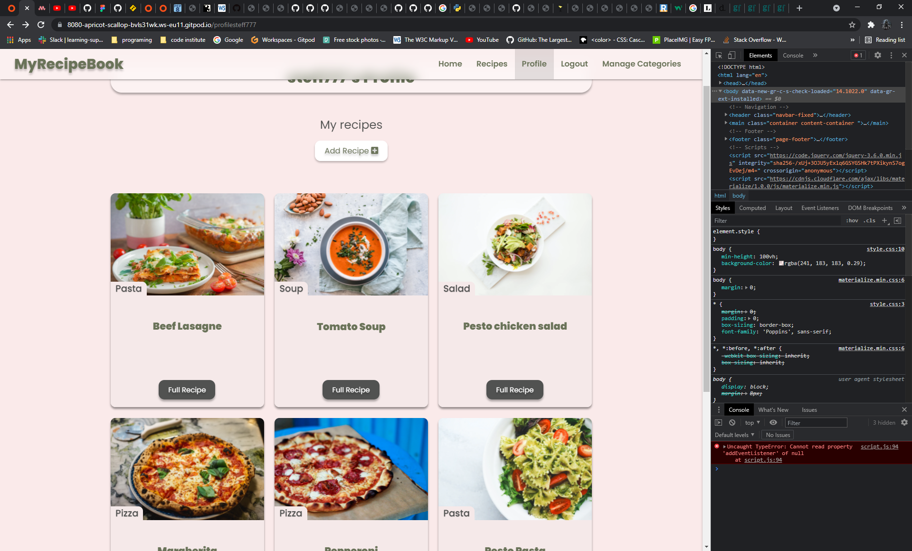
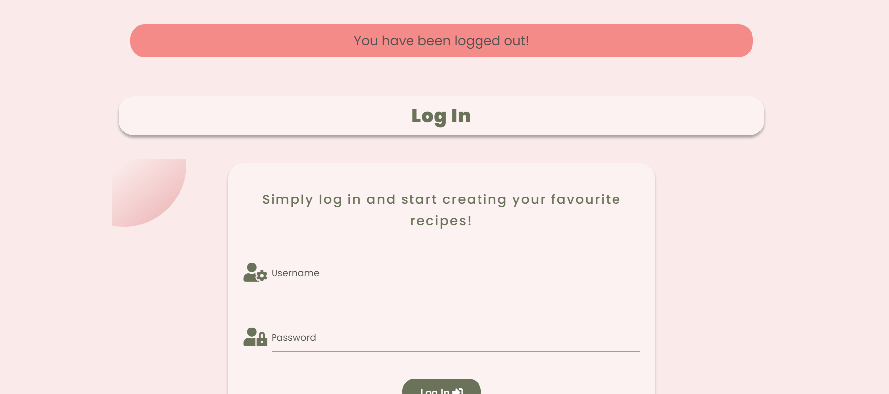
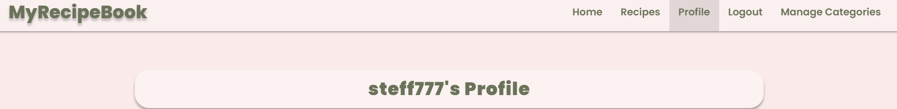
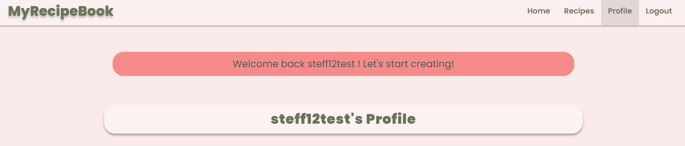
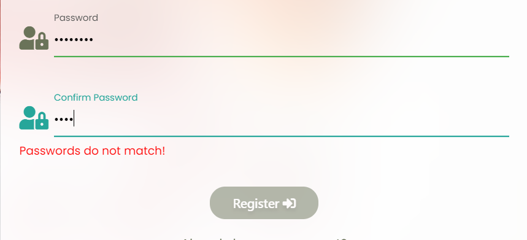
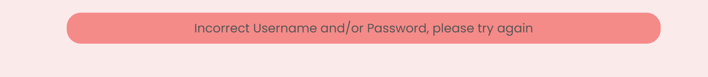
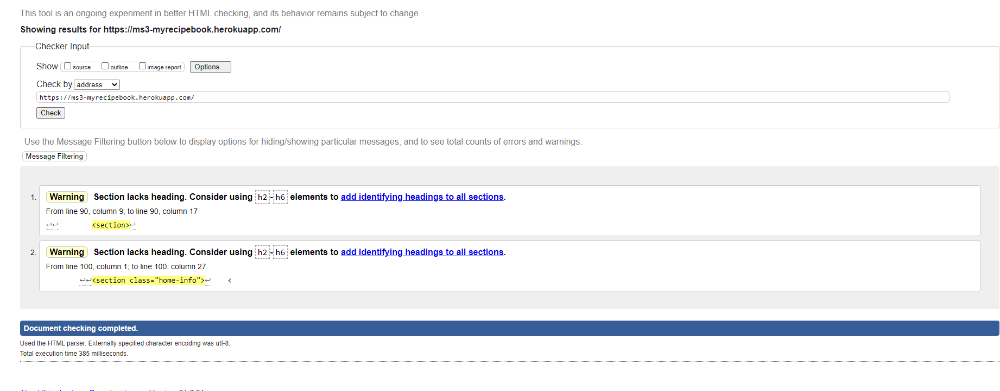
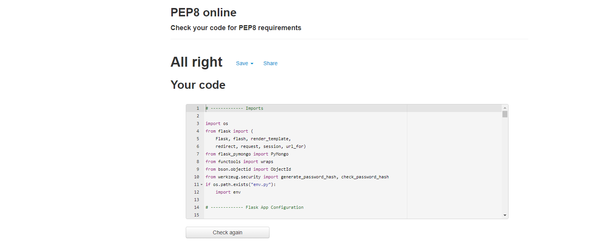
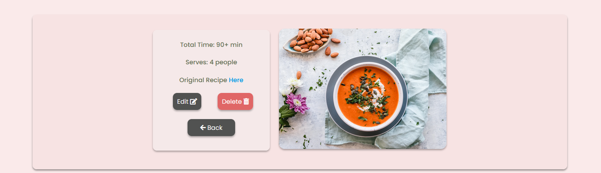

<h1 align="center">MyRecipeBook</h1>

[View Live Site Here](https://ms3-myrecipebook.herokuapp.com/)

## Testing
### Bugs and fixes
- Bug:
Had an issue with **Materialize sidenav overlay**. When you open the sidenav, the content is barely visible.

- Fix:
Did research on how to deal with this issue and found a solution on [Stack Overflow](https://stackoverflow.com/questions/38642911/how-to-disable-sidenav-overlay-in-materializecss).
Then set the height and width of the overlay to **0**.

- Bug:
An issue with Event Listener when trying to check if passwords match. 
As I added the same Event Listener to multiple elements and had a conflict on other pages.

    
        [password, confirmPassword].addEventListener('click', checkIfPasswordsMatch)

- Fix:
Add onclick event in HTML to the elements and remove the Event Listener. Also probably could have targeted the elements by their id rather than class, and kept the Event Listener.

- Bug:

Issue with Add Recipe page and more specifically:

        doocument.addEventListener('click', deleteIngredient)

I was trying to add an Event Listener to an element that has not been created yet. Did research and found this on [Stack Overflow](https://stackoverflow.com/questions/30601620/adding-an-event-listener-to-an-element-that-doesnt-exist-yet-in-vanilla-javascr). Then decided to use the above code and all was fine till the next day when I could not do anything on the site. Once you get to Add Recipe page the site freezes and can not navigate to a different page.

- Fix:

Spoke to a Tutor and realized what the issue was. Then as advised did this:

        ingredientRow.addEventListener('click', deleteIngredient)

So instead of adding Event Listener to the document, just add it to the parent element.

**_Plese not that further into the development of the project decided to use jQuery and reduce code used for the same purpose. It also improved the functionality._**

        $(ingredientRow).on('click', '.remove-field', function(e) {
                e.preventDefault();
                $(this).parent('div').remove();
                ingredient--;
        });

- Bug:

An issue with cards on the Profile page

- Fix:

Decided to use Materialize card and add some custom styling 

- Bug:

An issue with text overflowing 

- Fix:

Add ` overflow: auto; ` to element with class **panel-ingredients**

- Bug:

The element with class **card-panel-full-recipe** doesn't have a correct height when the user viewing the recipe is not who created it. If a user views his recipe then there are edit and delete buttons on top of the back button. This is creating a height difference.

- Fix:

Add ` margin-top: 40px; ` to **back-btn-row** class, to give some space from the text on top and ` min-height: 290px; ` to **card-panel-full-recipe** class, to fix the height issue. 

- Bug:

Event listener bug:

- Fix:

Add onclick event on the element in HTML and remove Event Listener form script.js file

## Testing User Stories

- First-time visitor

  - The user can easily navigate to the Login or Register page and create/log into their account. Just have to click
  on the navigation menu at the top of the website, or if they are on the Home page click the register/login buttons.

 
  
  

  - If the user navigates to the Recipes page, where he/she can find all recipes currently on the database. Also can use the search bar, to query for a specific recipe.

 

  

  

  - If the user has created an account, he/she can view the full recipe page

 

- Returning visitor

  - The user can easily navigate to the Login page and log back into the site, and use all its features.

 

  - After logging back to their account, the user will be redirected to their _Profile_ page, and from there simply click on the **Add Recipe** button to start adding a new recipe. After just fill all needed fields on the Add Recipe Form.

 

  - The user can view all recipes he/she has created on their Profile Page

  - The user can also edit a recipe they have created, by viewing the full recipe and clicking on the edit button. From there just have to amend the fields that are needed, and when finished just click the **Edit Recipe** button.

 

  - If the user requires to delete a recipe, simply click view full recipe on the recipe he/she had created and from there can use the delete button to delete the recipe

 

- As an **admin**

  - If the session user is an admin, he/she will have access to the Manage Categories page. There the user can see all current recipes and also click on the **Add Category** button. After just enter a name for a category and submit the form by clicking on the **Add Category** button

 

## Manual Testing

#### Testing Navigation

If user is not in session:

<table>
    <tr>
        <th>Test</th>
        <th>Expected Outcome</th>
        <th>Result</th>
    </tr>
    <tr>
        <td>Home</td>
        <td>When clicked on Home, takes us to Home page</td>
        <td>Pass</td>
    </tr>
    <tr>
        <td>Recipe</td>
        <td>When clicked on Recipes, takes us to Recipes page</td>
        <td>Pass</td>
    </tr>
    <tr>
        <td>Register</td>
        <td>When clicked on Register, takes us to Register page</td>
        <td>Pass</td>
    </tr>
    <tr>
        <td>Login</td>
        <td>When clicked on Login, takes us to Login page</td>
        <td>Pass</td>
    </tr>
</table>

If user in session:

<table>
    <tr>
        <th>Test</th>
        <th>Expected Outcome</th>
        <th>Result</th>
    </tr>
    <tr>
        <td>Home</td>
        <td>When clicked on Home, takes us to Home page</td>
        <td>Pass</td>
    </tr>
    <tr>
        <td>Recipe</td>
        <td>When clicked on Recipes, takes us to Recipes page</td>
        <td>Pass</td>
    </tr>
    <tr>
        <td>Profile</td>
        <td>When clicked on Profile, takes us to Profile page</td>
        <td>Pass</td>
    </tr>
    <tr>
        <td>Logout</td>
        <td>When clicked on Logout, remove user from session and redirect to Login</td>
        <td>Pass</td>
    </tr>
    <tr>
        <td>Manage Categories</td>
        <td>
            If user in session is admin, show Manage Categories link and give the user access to it.
            If the user in session is not admin, hide Manage Categories link and restrict access to it.
        </td>
        <td>Pass</td>
    </tr>
</table>

#### Testing Buttons

<table>
    <tr>
        <th>Test</th>
        <th>Expected Outcome</th>
        <th>Result</th>
    </tr>
    <tr>
        <td>Register button</td>
        <td>When clicked on Register button on Home page,
            only when user not in session, takes us to Register page.
        </td>
        <td>Pass</td>
    </tr>
    <tr>
        <td>Login button</td>
        <td>When clicked on Login button on Home page,
            only when user not in session, take us to Login page
        </td>
        <td>Pass</td>
    </tr>
    <tr>
        <td>Recipes button</td>
        <td>When clicked on Recipe button on Home page, only when user in session, takes us to Recipes page.</td>
        <td>Pass</td>
    </tr>
    <tr>
        <td>Profile button</td>
        <td>When clicked on Profile button on Home page, only when user in session, take us to Profile page.</td>
        <td>Pass</td>
    </tr>
    <tr>
        <td>Search button</td>
        <td>
            After entering a recipe name, category name, or ingredient name to search,
            and clicking Search button on Recipes page, display recipes. If there is no match,
            display a message for the user.
        </td>
        <td>Pass</td>
    </tr>
    <tr>
        <td>Reset</td>
        <td>When clicked on Reset button on Recipes page, reload the page</td>
        <td>Pass</td>
    </tr>
</table>

<table>
    <tr>
        <th>Test</th>
        <th>Expected Outcome</th>
        <th>Result</th>
    </tr>
    <tr>
        <td>Full Recipe button</td>
        <td>When clicked on Full Recipe button on Profile or Recipes pages,
            only when user in session, takes us to Full Recipe page.
        </td>
        <td>Pass</td>
    </tr>
    <tr>
        <td>Add Recipe button</td>
        <td>When clicked on Add Recipe button on Profile page,
            only when user in session, take us to Add Recipe page
        </td>
        <td>Pass</td>
    </tr>
    <tr>
        <td>Edit button</td>
        <td>When clicked on Edit button on Full Recipe page, only when user in session, takes us to Edit Recipe page.</td>
        <td>Pass</td>
    </tr>
    <tr>
        <td>Delete button</td>
        <td>When clicked on Delete button on Full Recipe page, only when user in session,
            and recipe was added by the same user, display a modal with a warning message,
            letting the user know what he/she is about to do is permanent, and provide a 
            cancel button to go back, or a delete if the user wishes to proceed.</td>
        <td>Pass</td>
    </tr>
    <tr>
        <td>Back button</td>
        <td>
            After clicking the Back button on Full Recipe Page, take us to the previous page.
        </td>
        <td>Pass</td>
    </tr>
</table>

#### Testing Forms

- Register Form

 <table>
    <tr>
        <th>Test</th>
        <th>Expected Outcome</th>
        <th>Result</th>
    </tr>
    <tr>
        <td>Username Field</td>
        <td>If a user tries to submit the form without entering a username, 
           display a message that this field is required.
        </td>
        <td>Pass</td>
    </tr>
    <tr>
        <td>Email Address</td>
        <td>If the user enters a wrong email format, display a message to inform them.</td>
        <td>Pass</td>
    </tr>
    <tr>
        <td>Password</td>
        <td>If a user tries to submit without entering a password or the format doesn't match,
            display a message.
        </td>
        <td>Pass</td>
    </tr>
    <tr>
        <td>Confirm Password</td>
        <td>When the user confirms the password he/she entered, and if they do not match,
            display a message to let the user know the passwords do not match.
            Also disable the submit button to prevent a form submission.
        </td>
        <td>Pass</td>
    </tr>
</table>

- Login Form

 <table>
    <tr>
        <th>Test</th>
        <th>Expected Outcome</th>
        <th>Result</th>
    </tr>
    <tr>
        <td>Username Field</td>
        <td>If the user tries to log in with wrong username,
            provide the user with a message to inform them.
        </td>
        <td>Pass</td>
    </tr>
    <tr>
        <td>Password</td>
        <td>If the user tries to log in with wrong password,
            provide the user with a message to inform them.
        </td>
        <td>Pass</td>
    </tr>
</table>

**_Please note that when testing the forms realized that there is no information for the user to know what the required format of the username or password fields is. Will be implemented in the future. Thank you_** 😀.

### W3C Validator Testing

The W3C Markup Validator and W3C CSS Validator Services were used to validate every page of the project to ensure there were
no syntax errors in the project.

[W3C Markup Validator](https://validator.w3.org/)

-   No errors were found. Only two warnings for section missing a heading.

[W3C CSS Validator](https://jigsaw.w3.org/css-validator/)

- Found errors for using `backdrop-filter: blur();` property. Could not find a way around it, even after adding vendor prefixes.

- One Materialize Error

- All other warnings are from Materialize, vendor prefixes, or Font Awesome.

### [JSHint](https://jshint.com/)

- No errors were found. Only warnings for using **_let, const, arrow functions_**.

### [PEP8](http://pep8online.com/)

- No errors were found.

### Additional Testing

-   Laptop & Desktop

    -   Chrome

        -   All tested and working fine

    -   Edge

        -   All tested and working fine

    -   Opera

        -   All tested and working fine

    -   Firefox

        -  When tested on Firefox found the following error:
            
            - Everywhere I used the property `backdrop-filter: blur();`, it does not work, and also on the Full Recipe page,
            the image panel and info panel are half the size they should be.

 -   Tested on Chrome using different devices via google chrome device emulators and all works fine.
    -   Also tested on the following physical mobile devices:

        1.  Samsung Galaxy S9 plus and works fine

        2.  Samsung Galaxy s10 and works fine

