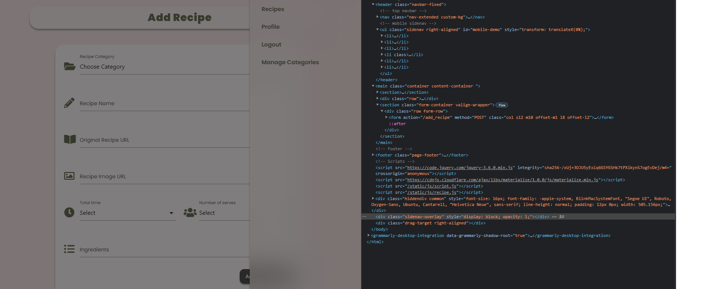
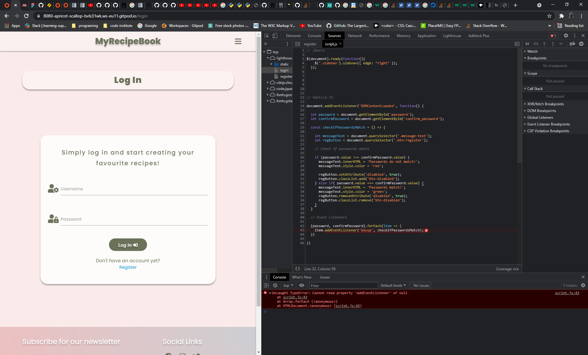
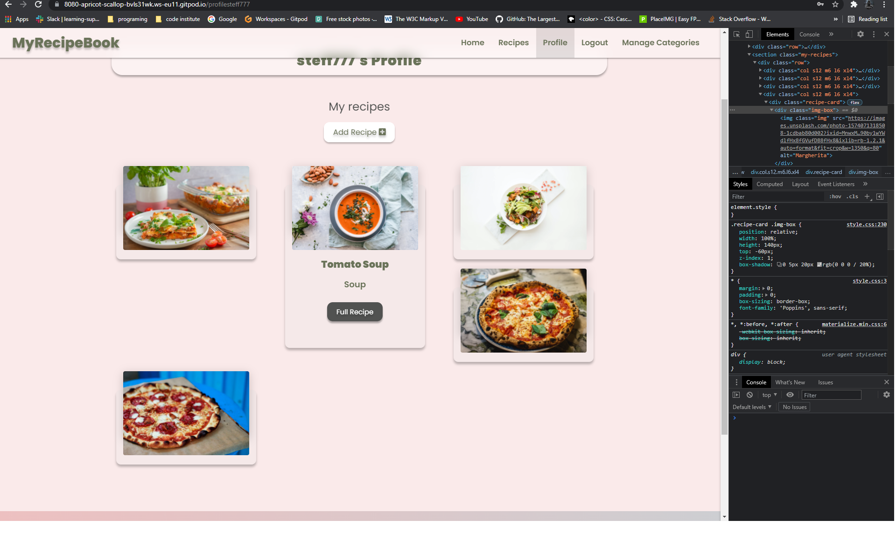
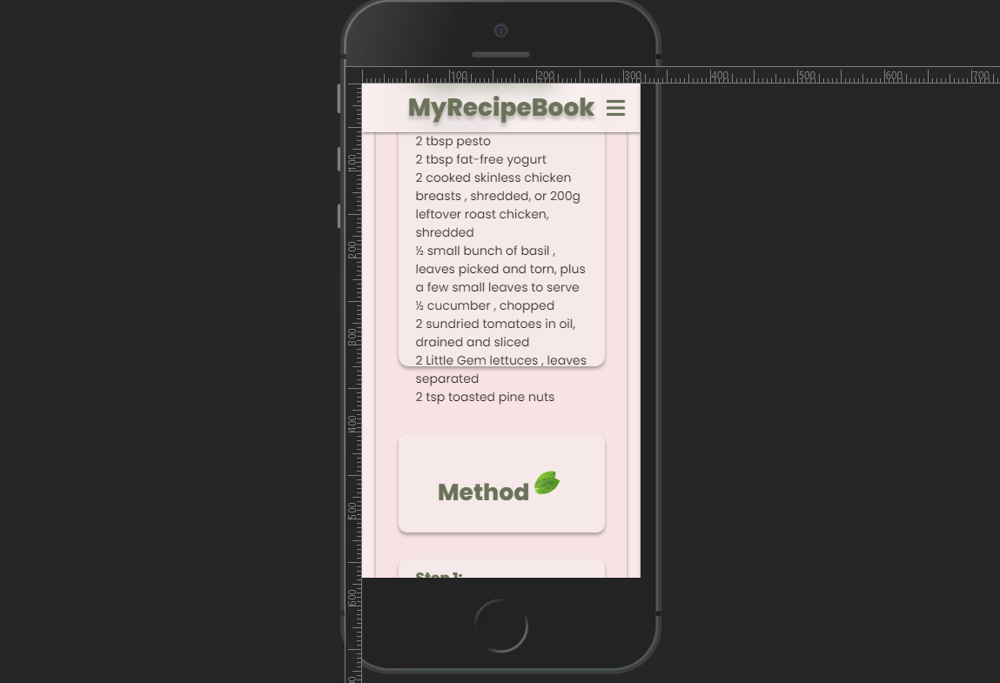
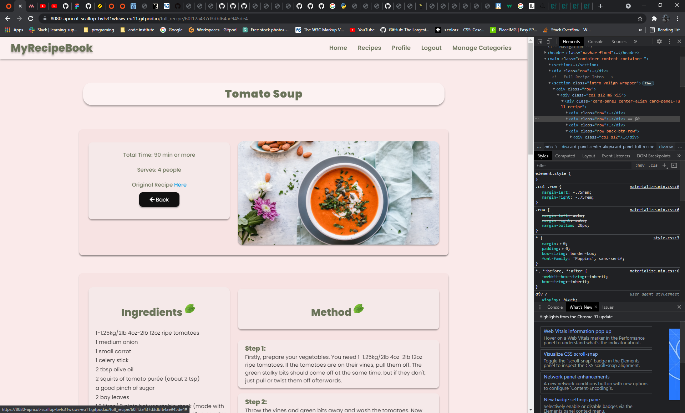

## Testing
### Bugs and fixes
- Bug:
Had an issue with **Materialize sidenav overlay**. When you open the sidenav, content is barely visible.

- Fix:
Did a research on how to deal with this issue and found solution on [Stack Overflow](https://stackoverflow.com/questions/38642911/how-to-disable-sidenav-overlay-in-materializecss).
Then set the height and width of the overlay to **0**.

- Bug:
Issue with Event Listener when trying to check if passwords match. 
As I added same Event Listener to multiple elements and had a conflict on other pages.

    
        [password, confirmPassword].addEventListener('click', checkIfPasswordsMatch)

- Fix:
Add onclick event in HTML to the elements and remove the Event Listener. Also probably could have targeted the elements by their id rather than class, and kept the Event Listener.

- Bug:

Issue with Add Recipe page and more specifically:

        doocument.addEventListener('click', deleteIngredient)

I was trying to add an Event Listener to an element that has not been created yet. Did a research and found this on [Stack Overflow](https://stackoverflow.com/questions/30601620/adding-an-event-listener-to-an-element-that-doesnt-exist-yet-in-vanilla-javascr). Then decided to use the above code and all was fine til next day when I could not do anything on the site. Once you get to Add Recipe page the site freezes and can not navigate to different page.

- Fix:

Spoke to a Tutor and realized what the issue was. Then as advised did this:

        ingredientRow.addEventListener('click', deleteIngredient)

So insted of adding Event Listener to the document, just add it to the parent element.

- Bug:

Issue with cards on Profile page

- Fix:

Decided to use Materialize card and add some custom styling 

- Bug:

Issue with text overflowing 

- Fix:

Add ` overflow: auto; ` to element with class **panel-ingredients**

- Bug:

The element with class **card-panel-full-recipe** desn't have a correct height when user viewing the recipe is not who created it. If a user views his own recipe then there are edit and delete buttons on top of back button. This is creating a difference in height.

- Fix:

Add ` margin-top: 40px; ` to **back-btn-row** class, to give some space from the text on top and ` min-height: 290px; ` to **card-panel-full-recipe** class, to fix the height issue. 