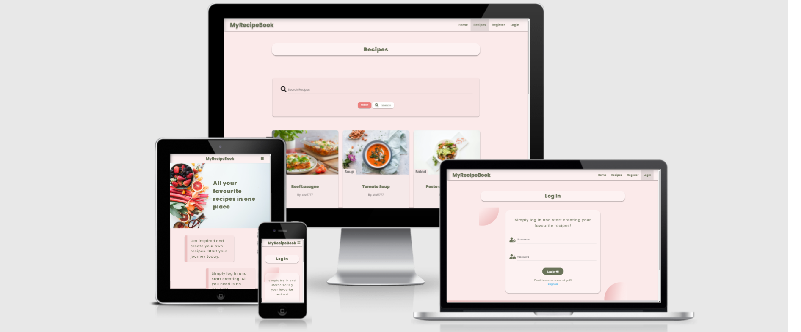
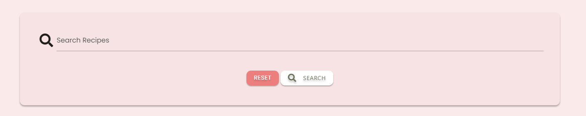
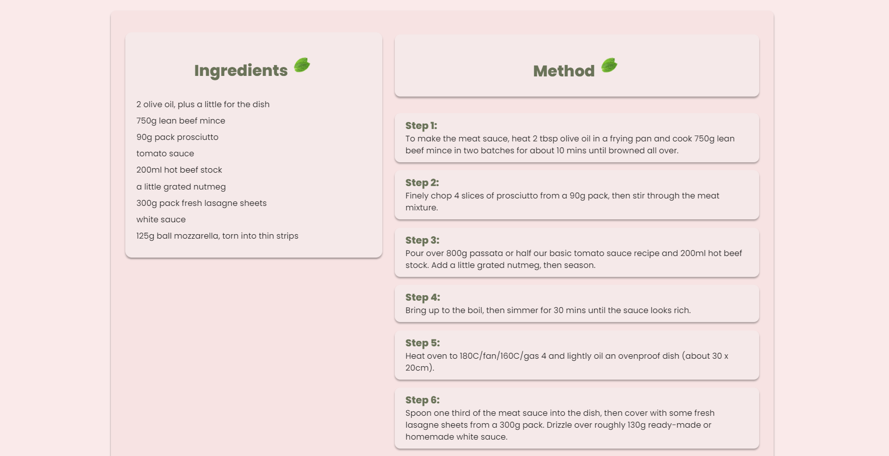
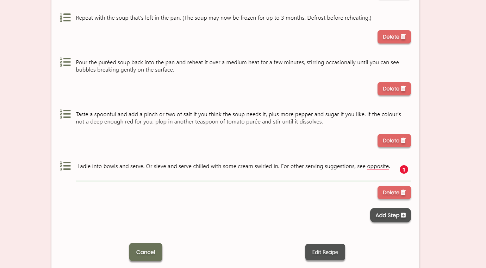
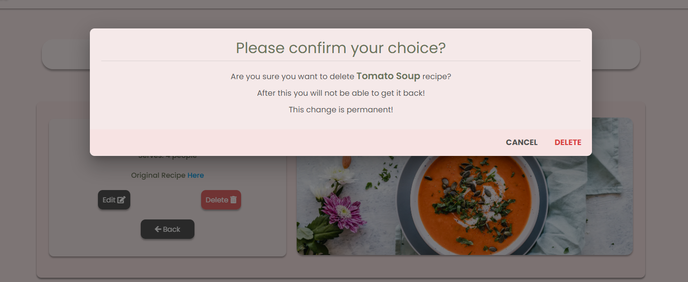

<h1 align="center">MyRecipeBook</h1>

## Testing
### Bugs and fixes
- Bug:
Had an issue with **Materialize sidenav overlay**. When you open the sidenav, content is barely visible.

- Fix:
Did a research on how to deal with this issue and found solution on [Stack Overflow](https://stackoverflow.com/questions/38642911/how-to-disable-sidenav-overlay-in-materializecss).
Then set the height and width of the overlay to **0**.

- Bug:
Issue with Event Listener when trying to check if passwords match. 
As I added same Event Listener to multiple elements and had a conflict on other pages.

    
        [password, confirmPassword].addEventListener('click', checkIfPasswordsMatch)

- Fix:
Add onclick event in HTML to the elements and remove the Event Listener. Also probably could have targeted the elements by their id rather than class, and kept the Event Listener.

- Bug:

Issue with Add Recipe page and more specifically:

        doocument.addEventListener('click', deleteIngredient)

I was trying to add an Event Listener to an element that has not been created yet. Did a research and found this on [Stack Overflow](https://stackoverflow.com/questions/30601620/adding-an-event-listener-to-an-element-that-doesnt-exist-yet-in-vanilla-javascr). Then decided to use the above code and all was fine til next day when I could not do anything on the site. Once you get to Add Recipe page the site freezes and can not navigate to different page.

- Fix:

Spoke to a Tutor and realized what the issue was. Then as advised did this:

        ingredientRow.addEventListener('click', deleteIngredient)

So insted of adding Event Listener to the document, just add it to the parent element.

**_Plese not that further into the development of the project decided to use jQuery and reduce code used for the same purpose. It also improved the functionality._**

        $(ingredientRow).on('click', '.remove-field', function(e) {
                e.preventDefault();
                $(this).parent('div').remove();
                ingredient--;
        });

- Bug:

Issue with cards on Profile page

- Fix:

Decided to use Materialize card and add some custom styling 

- Bug:

Issue with text overflowing 

- Fix:

Add ` overflow: auto; ` to element with class **panel-ingredients**

- Bug:

The element with class **card-panel-full-recipe** desn't have a correct height when user viewing the recipe is not who created it. If a user views his own recipe then there are edit and delete buttons on top of back button. This is creating a difference in height.

- Fix:

Add ` margin-top: 40px; ` to **back-btn-row** class, to give some space from the text on top and ` min-height: 290px; ` to **card-panel-full-recipe** class, to fix the height issue. 

- Bug:

Event listener bug:

- Fix:

Add onclick event on the element in HTML and remove Event Listener form script.js file

## Testing User Stories

- First time visitor

  - The user can easily navigate to Login or Register page and create/log into their account. Just have to click
  on the navigation menu at the top of the website, or if they are on Home page click register/login buttons.

 
  
  

  - If the user navigates to Recipes page, there he/she can find all recipes currently on the database. Also can use the search bar, to query for a specific recipe.

 

  

  

  - If the user has created an account, he/she can view full recipe page

 

- Returning visitor

  - The user can easily navigate to Login page and log back into the site, and use all it's features.

 

  - After loging back to their accout, the user will be reidrected to their _Profile_ page, and from there simply click on the **Add Recipe** button to start adding a new recipe. After just fill all needed fields on the Add Recipe Form.

 

  - The user can view all recipes he/she has created on their Profile Page

  - The user can also edit a recipe they have created, by viewing the full recipe and clicking on the edit button. From there just have to amend the fields that are needed, and when finished just click **Edit Recipe** button.

 

  - If the user requires to delete a recipe, simply click view full recipe on the recipe he/she had created and from there can use the delete button to delete the recipe

 

- As an **admin**

  - If the session user is admin, he/she will have access to Manage Categories page. There the user can see all current recipes and also click on the **Add Category** button. After just enter a name for category and submit the form by clickig on the **Add Category** button

 

